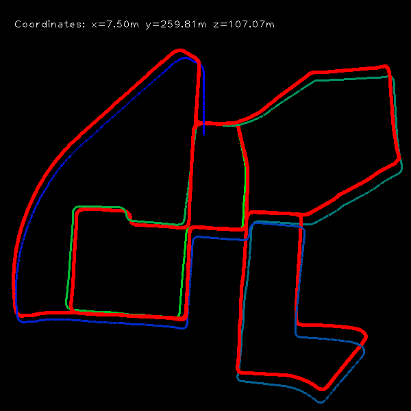

# Visual Odometry with SuperGlue (Python 3 Optimized)

⚠️ **Dataset Requirement**:  
To run this project, you need to download the following datasets:
1. **KITTI Gray Version Dataset** (22 GB): [Download Link](http://www.cvlibs.net/datasets/kitti/eval_odometry.php)  
   Download and extract the `gray` version of the KITTI odometry dataset, which contains image sequences.
2. **Ground Truth Data** (5 MB):  
   The ground truth file (e.g., `00.txt`) is included in the KITTI dataset under the `sequences` folder.

Update the paths in `test.py` to reflect your local dataset directories. For example:

```python
cam = PinholeCamera(1241.0, 376.0, 718.8560, 718.8560, 607.1928, 185.2157)
vo = VisualOdometry(cam, '/path/to/sequences/00.txt')

traj = np.zeros((600, 600, 3), dtype=np.uint8)

for img_id in range(4541):
    img_path = '/path/to/sequences/00/image_0/' + str(img_id).zfill(6) + '.png'
```

---

This project implements a Visual Odometry (VO) pipeline optimized for Python 3. The implementation uses SuperGlue for feature matching, providing superior accuracy compared to traditional feature matching methods. The project is adapted and improved from the original [uoip/monoVO-python](https://github.com/uoip/monoVO-python) repository.

## Sample Trajectory Visualization

Below is an example trajectory visualization showing the comparison between the estimated path (green) and the ground truth path (red):



## Contents

- **`test.py`**: Main script to run the visual odometry process and visualize the trajectory.
- **`visual_odometry.py`**: Contains the `PinholeCamera` and `VisualOdometry` classes, utilizing SuperGlue for feature matching.

## Features

- **SuperGlue Feature Matching**: Utilizes SuperGlue, a transformer-based architecture, for accurate and robust feature matching between frames.
- **Pose Estimation**: Computes the camera's motion using the Essential Matrix and pose recovery methods.
- **Trajectory Visualization**: Draws the estimated trajectory alongside the ground truth trajectory for comparison.
- **CUDA Support**: The code automatically uses CUDA if a compatible GPU is detected, accelerating SuperGlue computations.
- **Python 3 Compatibility**: Fully optimized for Python 3.

## Installation

### Dependencies

This project requires the following libraries:

- `numpy`
- `opencv-python`
- `torch` (PyTorch)

### Installing PyTorch

Follow the [official PyTorch installation guide](https://pytorch.org/get-started/locally/) to install the appropriate version for your system, including CUDA support if you have a compatible NVIDIA GPU. For example, to install the CUDA 11.8-compatible version of PyTorch, use:

```bash
pip install torch torchvision torchaudio --index-url https://download.pytorch.org/whl/cu118
```

### Install Other Dependencies

Install `numpy` and `opencv-python` using pip:

```bash
pip install numpy opencv-python
```

## Dataset Preparation

1. **Download KITTI Dataset**:  
   - Download the **KITTI Gray Version Dataset** (22 GB) from the [KITTI Odometry Benchmark](http://www.cvlibs.net/datasets/kitti/eval_odometry.php).
   - Extract the dataset and note the path to the `sequences` folder.

2. **Ground Truth Data**:  
   - The ground truth trajectory file (`00.txt`) can be found in the same dataset under the `sequences/00/` directory.

3. **Update Paths**:  
   In `test.py`, set the appropriate paths for both the image sequence and the ground truth:

   ```python
   cam = PinholeCamera(1241.0, 376.0, 718.8560, 718.8560, 607.1928, 185.2157)
   vo = VisualOdometry(cam, '/path/to/sequences/00.txt')

   for img_id in range(4541):
       img_path = '/path/to/sequences/00/image_0/' + str(img_id).zfill(6) + '.png'
   ```

## Usage

1. **Set Camera Parameters**: Update the `PinholeCamera` instance in `test.py` with your camera's intrinsic parameters:

    ```python
    cam = PinholeCamera(1241.0, 376.0, 718.8560, 718.8560, 607.1928, 185.2157)
    ```

2. **Run the Script**:

    ```bash
    python test.py
    ```

### Output

- **Trajectory Visualization**: Two windows will appear:
  - **Current Frame**: Displays the current image being processed.
  - **Trajectory**: Shows the estimated (green) and ground truth (red) trajectories.

- The final trajectory image is saved as `map.png` in the working directory.

## CUDA Support

The code is optimized to run on a CUDA-compatible GPU if available. PyTorch will automatically detect the GPU and perform computations on the GPU for faster performance. If CUDA is not available, the code will fall back to CPU execution.

## Reference

This project is based on [uoip/monoVO-python](https://github.com/uoip/monoVO-python) and adapted with SuperGlue for improved performance.

## License

This project is licensed under the MIT License.
